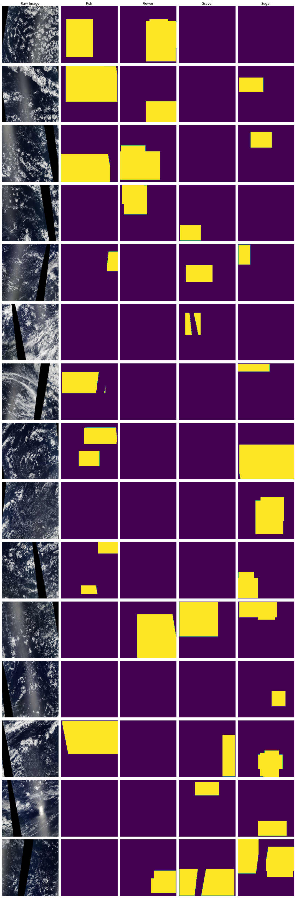
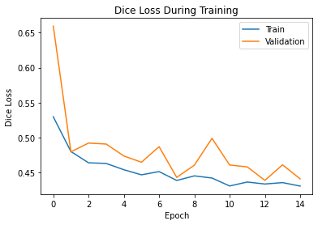
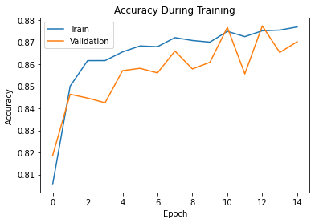
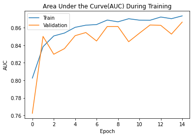
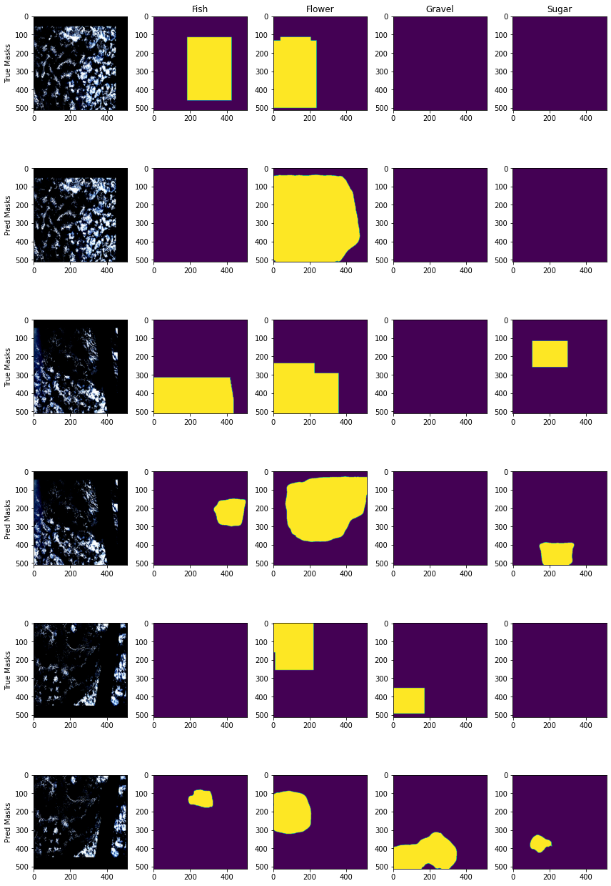

# Segmentation of Cloud Classifications from Satellite Images

# Introduction
With increasing concerns about climate change, researchers are trying to build more robust climate models. Clouds play a large role in Earth's climate, making them a crucial part of climate models. However, cloud classification is a tedious task, so automating this process would lead to great strides in existing climate models and more accurate weather prediction. In particular, the following cloud structures are of interest to scientists; Sugar, Gravel, Fish, and Flower clouds. This project is inspired from a [Kaggle competition](https://www.kaggle.com/c/understanding_cloud_organization). From looking at submissions from other Data Scientists, I saw that people took two approaches; image segmentation and bounding box prediction. My project aims to build an image segmentation model rather than a bounding box prediction model because these models are of more interest to me. For more information about the application of this project please visit the link above.
# The Data
The data used in this project is satellite imagery from NASA Worldview. The images have three bands (R, G, B) and are each accompanied with pixel encodings for four classifications (fish, flower, gravel, and sugar clouds). The pixel encodings were determined as the union of the labels produced by three different scientists per image. In total, a team of 68 scientists at the Max-Planck-Institute for Meterology in Hamburg, Germany created the labels for this data. More information can be found [here](https://www.kaggle.com/c/understanding_cloud_organization/data). In total, there are 5,546 images with pixel encodings for the cloud classification masks. There are an additional 3,703 test images that have to pixel encoding information.
# Exploratory Data Analysis
Each image is of size 1400 X 2100 pixels and has 3 channels (RGB). The masks are mostly rigid shaped, which is strange because clouds are not rigid in shape. However, this must be because it was easier to classify the clouds by drawing a shape around them rather than actually classifying pixel by pixel on such large images. Another thing to note is that the masks often times overlap. I expect that these two qualities of this dataset will cause some troubles in this project. To see some sample images and masks, see the image below.

# Modeling
### The Loss Function
Finding a good loss function was crucial for these models. Initially, I used cross entropy, but found that often times the model was simply predicting that every pixel was not a cloud. This was because for each image, there is often a blank mask for at least one of the cloud types, and for the masks that weren't blank, they usually made up a small section of the entire image. Therefore, the model could receive decent accuracy by simply saying each pixel was not any of the four classes of clouds.
Through research I found that a "Dice Loss" was the solution to this issue. A dice loss multiplies the predicted probabilities from the model with the binary labels for the respective class and multiplies the grand sum by 2. This becomes the numerator in the loss. Then the square of the predictions and mask values are summed and added together. This becomes the denominator of the loss. Since a perfect prediction would yield a score of 1 and the worst prediction would yield a score of 0, the loss value becomes 1 - dice loss so that minimizing the loss function will yield us better results instead of worse results (since the original dice loss would need to be maximized). For more information on the dice loss, visit this [article](https://www.jeremyjordan.me/semantic-segmentation/) and search for "Dice coefficient". The benefit of this loss function is that the pixel predictions for the pixels that contain the cloud type will be counted the most.
I used the implementation of the Dice loss using [segmentation_models_pytorch's implementation](https://github.com/qubvel/segmentation_models.pytorch/blob/master/segmentation_models_pytorch/losses/dice.py). Based on the source code in the link, I am using 'multilabel' mode which expects multiple layers of binary labels (one layer per each cloud mask).
### Evaluation Metrics
The evaluation of the model is done through three different metrics. The first is the value of the dice loss function. The second is the overall accuracy of the prediction compared to the label masks. The third is the overall area under the curve (AUC) of the prediction compared to the label masks. These metrics are evaluated for each cloud mask and averaged.
### Dataset Abstraction
The data needed to be abstracted through the creation of a class that inherits from the PyTorch Dataset class. This class is instantiated by passing in a dataframe that has a column of strings that take the form of "{image file name} {cloud label}" for each entry. There is also a column named "EncodedPixels" which is a string of space separated numbers. First, the image file name and cloud label are parsed into their own separate columns. Then, the column EncodedPixels is parsed into a list of integers, which is then converted into a list of pairs of numbers, where each pair has a starting pixel index and a length integer. For each image file name, there are 4 rows, one for each cloud classification. The mask for each cloud classification of each image file is created using the integer pairs parsed from the "EncodedPixels" column. The starting pixel location integer corresponds to the index of a flattened image array of size 1400 X 2100 pixels. Therefore, an array of length 2,940,000 filled with 0's is created and for each integer pair, the arrays values at indices (starting pixel + length) become 1, signifiying a positive classification of that cloud. For each unique image file, the image is loaded and converted to a tensor and reshaped to [3,512,512]. Then, the mask for each of the cloud classifications is computed, reshaped to [512,512]
 and stacked into a label tensor of shape [512,512,4]. 
 The value at a particular index of this data set abstraction is the input and label tensor for that particular index in a listing of unique image file names.
## Initial Model Experimentation
At first, I wanted to try out some of the basic implementations we reviewed in class. First, I tried a basic CNN where the height and width of the layers stay constant. Second, I tried a CNN with transposes to have the model work more efficiently and hopefully learn to represent the important parts of the images within a smaller space and then use that representation to project predictions up to the correct output size. Lastly, in my initial modeling attempts, I tried a UNet model architecture. 
Since there are over 5,000 images in the training set, I decided to train these initial models on a random sample of 500 of the training images to keep training time down. The intention is to find what works best and then train that model on all of the data at the end. The results from this intial modeling is shown below.
#### Basic CNN Architecture
A good starting point for this project was to do some simple modeling using CNNs with padding such that the convolutions are the same size at each layer. After playing around with the depth of the model, using a simple Adam optimizer (using the default learning rate and no scheduler), I found that after 8 convolutional layers (the first four having a kernel size of 9 and the last 4 having a kernel size of 3, and all layers have 64 filters), each followed by batch normalization and a leakly relu activation, the model didn't really see much improvement. The dice loss value leveled out at ~55%, the overall accuracy at ~75%, and the AUC at ~75%. For visualizations of this work, visit the [CNN Modeling Notebook](https://github.com/harperd17/cloud_classification/blob/main/modeling/CNN_segmentation_model.ipynb). From looking at the visualizations, the predicted segmentation is not performing well. For blank masks, the predictions yield significant areas of positive classifications. In addition, the areas of positive classification predictions are not shaped similar to the label masks and also have holes, which is to be expected with this basic architecture.
#### CNN Architecture with Transposes
The next step for me was the explore a basic CNN architecture, but with transposed layers so that the layer shapes decrease and then later increase. After experimenting with different levels of complexity, I found that using 5 rounds of pooling (factor of 2) followed by 2 convolutional layers worked. The convolutional layers in the first round have 64 filters, and each subsequent round has twice the ammount of filters as the previous one. This is then followed by 5 rounds of transposed convolutional layers with the opposite pattern in the number of filters. Each convolutional layer in this model has a layer of batch normalization and a leaky relu activation. Making the model more complex didn't yield substantially better results. This models dice loss flattened at ~50%, the accuracy topped out at ~80%, and the AUC topped out at ~75%. The visualizations of the predictions from this model are similar in quality to those from the basic CNN architecture, with the exception that the holes in the predicted masks have disappeared. The see the visualizations, visit the [CNN Modeling with Transposes Notebook](https://github.com/harperd17/cloud_classification/blob/main/modeling/transposed_CNN_segmentation_model.ipynb).
#### UNet Architecture
I also wanted to try designing and training a Unet model from scratch. The unet approach seems to be useful for this dataset because I would imagine cloud classification factors in both low level and high level details to make a classification for each pixel. The model I designed has 4 UNet blocks, ending with a convolutional layer that outputs 4 filters (one per class of cloud). This acheived a dice loss of ~50%, an accuracy of ~80%, and an AUC of ~78%. When looking at the predicted masks from this model, the results seem similar to when using the methods above. The predictions don't resemble the true masks very well. To see the results from this modeling, visit the [UNet Modeling Notebook](https://github.com/harperd17/cloud_classification/blob/main/modeling/UNet_segmentation_model.ipynb).
## Experimentation Using Existing Model Architectures
Next, I decided to try out some existing model architectures since cloud classification seems like a pretty complex problem. I looked through the [TorchSat](https://github.com/sshuair/torchsat) library and the [SegmentationModels](https://github.com/qubvel/segmentation_models.pytorch) library for some pretrained networks. Through the TorchSat library, I decided to try the Unet Resnet architecture. I tried using different encoder depths of 34, 101, or 152, 32 filters, and a drop out of 0.3. However, the network didn't train very well, and the predictions didn't look good. This also didn't work as well with the Dice Loss as it did with the Cross Entropy loss function. The accuracy didn't get above 60% and the AUC didn't get above 80%. 
Next, I tried using a model that had a ResNet encoder with imagenet weights from the SegmentationModels library. After doing 15 epochs of training, the Dice loss was ~0.2, achieving an overall accuracy of ~ 95% and an AUC of ~ 95%, with a trend of continued improvement. This was only trained on a random sample of 250 images with no augmentations, so the validation performance wasn't as good as the training performance. However, I am confident this will work well when trained with augmentations on the entire dataset. This will be my final model architecture.
Both of these networks I tried required a normalization layer which used means of [0.485, 0.456, 0.406] and standard deviations of [0.229, 0.224, 0.225].
To see this training, see the [Pretrained Networks Modeling Notebook](https://github.com/harperd17/cloud_classification/blob/main/modeling/pretrained_models.ipynb).
## Experimentation Using Thresholded Masks During Training
Since one of the limitations I had anticipated was that the cloud masks aren't exact, I decided to use adaptive thresholding on the original image in order to determine which pixels are clouds and which aren't. Then, I multiplied this thresholding mask with the classification masks so that only the positively classified pixels of the cloud mask that are actually clouds are used in the label mask. To see what this looks like and what was done, visit the [Cloud Thresholding Notebook](https://github.com/harperd17/cloud_classification/blob/main/EDA/only_clouds.ipynb).
Then, I trained the Resnet with imagenet weights model (model from SegmentationModels library) using these masks and acheived a dice loss of ~0.5, an accuracy of ~90%, and an AUC of ~83%. The dice loss was still trending downward and the AUC was still trending upward, but the accuracy had flat lined. I think this new set of masks introduced more complexity to this problem, so will not continue using these masks to train the final model. Training results can be seen in the [Modeling Thresholded Masks Notebook](https://github.com/harperd17/cloud_classification/blob/main/modeling/modeling_thresholded_masks.ipynb).
## Final Model
As mentioned before, my final model has a ResNet encoder with Imagenet weights. I used 90% of the data for training. Of this data, 80% was used for training and 20% was used for validation. The 10% not used for training or validation is being held as test data after the model is chosen. In order to make the model more robust I added transformations. The first is required for the pretrained model to work well and involves normalizing the input with means of [0.485, 0.456, 0.406] and standard deviations of [0.229, 0.224, 0.225]. The other transformations were for robustness of the model and include a random shift up to 15%, random brightness, and random flipping. The reason for the random brightness is that streaks of brightness show up in many of the satellite images, and I image this could be confusing for the model, so adding some randomly to the input images will force the model to learn to ignore it. I obtained the following results from training this model.

This model yielded the following sample predictions.

Overall, these predictions look much better than the predictions from my previous models. There aren't any obvious holes in the predicted regions, and for the most part, the predicted regions have significant overlap with the true regions. In cases where an image doesn't have any regions of a particular cloud, there often times aren't any predicted regions generated from the model. However, it appears there is more room for growth. For example, the predicted regions often overestimate the true region and are sometimes shifted. I think this is a difficult problem to solve and this project makes a nice leap towards an accurate solution.
## Future Additions
There are certainly more ways to improve this model. In particular, one could experiment with different optimizers. One could also experiment with learning rate schedulers. I didn't use any learning rate schedulers because the constant default learning rate for the Adams optimizer worked pretty well for me. Another reason is that this model requires a lot of time to train. Experimenting with different optimizers and learning rate schedulers would have been a painful process. However, it could potentially give the model a decent improvement. 
Another future addition could be more research into thresholding the masks. The thresholding I performed wasn't perfect and the model seemed to have a more difficult time training on it. However, the predictions from training of thresholded masks could be more useful. For example, it may be important to not only know the regions where certain clouds are present in a satellite image, but also how much area they make up. This is difficult to discern with the current masks.
## References/Citations
[Semantic Segmentation Article](https://www.jeremyjordan.me/semantic-segmentation/) - I used this for explaining the dice loss.
[Segmentation Models Library](https://github.com/qubvel/segmentation_models.pytorch) - I used this for loss functions, augmentation transforms, and pretrained networks.
[TorchSat Library](https://github.com/sshuair/torchsat) I used this for pretrained model architectures and augmentations.
[Inside Deep Learning](https://github.com/EdwardRaff/Inside-Deep-Learning) - I used this for guidance and training functions.
[Kaggle Notebooks](https://www.kaggle.com/c/understanding_cloud_organization/overview) - I scanned through some of the notebooks to help come up with data processing functions. Functions found from Kaggle are cited through coding comments.
